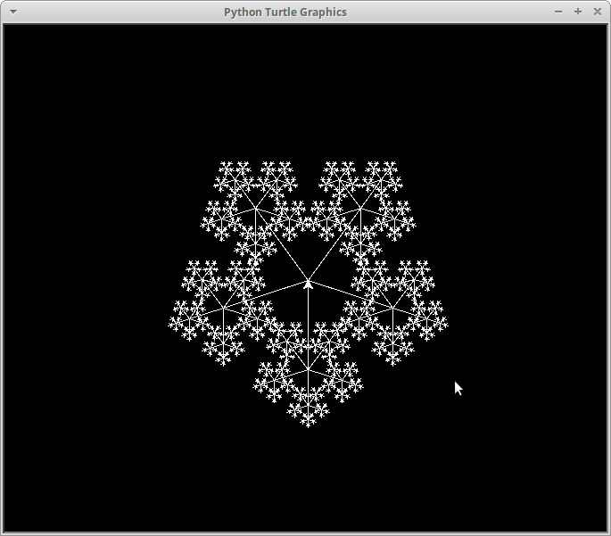

# Fractais
  
Projeto implementado na disciplina de Estrutura de Dados da Universidade Federal do Ceará campus Quixadá.



## Fractais implementados

* ice
* square
* tree
* wheat

## Dependências
  * python
  * python-tk

## Instalação de Dependências
```terminal
sudo apt-get install python
```

```terminal
sudo apt-get install python-tk
```